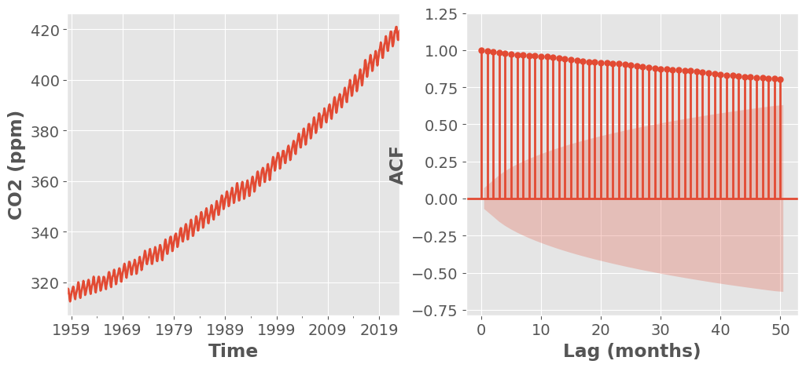

# Lecture 1: Introduction to Time Series

## Time Series

- Collection of observations made sequentially in time
- Data Types:
  - **Univariate**: Single observation at each time point (e.g. bike sale over time)
  - **Multivariate**: Multiple observations at each time point (e.g. bike sale + profit over time)
  - **Heirarchical**: Multiple time series, each with a hierarchical structure (e.g. bike sale + profit for each store over time)
- Common Tasks:
  - **Prediction/ Forecasting** (Supervised Learning)
    - Difficult since many factors
  - **Clustering/ Anomaly Detection** (Unsupervised Learning)

### Features of Time Series

#### Visualizing

- Time plot: x-axis = time, y-axis = value

#### Temporal Dependence

- Observations close in time are often correlated
  - Can quanitify using **autocorrelation**
- **Autocorrelation**: Correlation of a time series with a lagged version of itself
  - **Lag**: Time difference between two observations
  - **ACF**: Autocorrelation function
    - Plots autocorrelation for different lags
  - **PACF**: Partial autocorrelation function
    - Plots correlation between two observations after removing the effect of other lags
  - e.g. `data[t (lag=1)] = data[t].shift(t)`

##### Correlogram

- Plot of ACF vs. lag
- Helps identify patterns in time series
- Use `statsmodels.graphics.tsaplots.plot_acf()`

```python
from statsmodels.graphics.tsaplots import plot_acf

fig, (ax1,ax2) = plt.subplots(nrows=1, ncols=2, figsize=(11, 5))
plot_acf(data, lags=20, title='ACF', ax=ax1)
ax1.set_xlabel("Lag (years)")
ax1.set_ylabel('ACF')
```

<!-- TODO: add stuff about SE (2.2) -->




- CO2 plot has a trend so ACF for smaller lags tend to be higher
- **General Key Observations**:
  1. ACF almost always decays with lag
  2. If a series alternates (oscillates about mean), ACF will alternates too
  3. If a series has seasonal or cyclical fluctuations, the ACF will oscillate at the same frequency
  4. If there is a trend, ACF will decay slower (due to high correlation of the consecutive observations)
  5. Experience is required to interpret ACF

#### Time Series Patterns

1. **Trend**: Long-term increase/ decrease
2. **Seasonality**: Regular pattern of up and down fluctuations (fixed interval)
   - typically over smaller time frame
3. **Cyclic**: Fluctuations not of fixed period (unknown and changing interval)
   - typically over larger time frame

#### White Noise

- Time series with:
  - 0 mean
  - Constant variance
  - No autocorrelation
- Further assumed that it is iid and gaussian: $N(0, \sigma^2)$

- **Why do we care?**
  - Cannot predict white noise
  - If residuals from time series for a forecast should resemble white noise
    - Implies that the model has captured all the information in the data

### Time Series Decomposition

- When we decompose, we split the time series into 3 components:

  1. **Trend-cycle (T)**: Long-term increase/ decrease
  2. **Seasonal (S)**: same as seasonal above
  3. **Residual**: Random fluctuations


- **Additive Model**: $Y_t = T_t + S_t + R_t$
  - When the magnitude of the seasonal fluctuations does not change with the level of the time series
- **Multiplicative Model**: $Y_t = T_t \times S_t \times R_t$
  - When the magnitude of the seasonal fluctuations does change with the level of the time series
