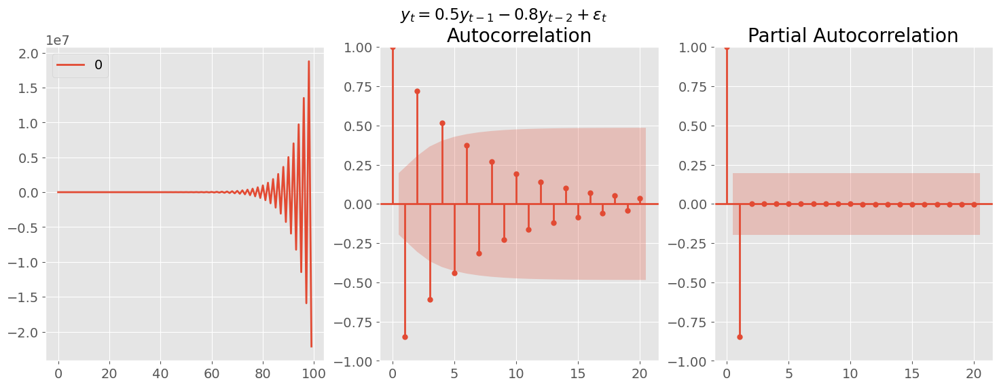
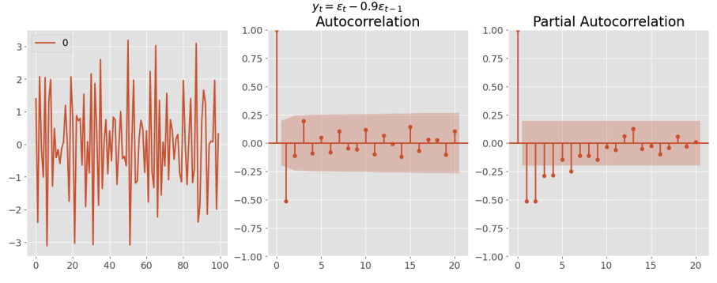

# Lecture 3: ARIMA Models

## ARIMA Models

- **ARIMA**: AutoRegressive Integrated Moving Average
- Commonly used for time series forecasting (other than exponential smoothing)
- Based on autocorrelation of data
- Do not model trend nor seasonality, so it is typically constrained to **stationary** data

### Stationarity

- Statistical properties of a time series do not change over time
  - Mean, variance is constant
  - Is roughly horizontal (no strong trend)
  - Does not show predictable patterns (no seasonality)
- DOES not mean that the time series is constant, just that the way it changes is constant
- It is one way of modelling dependence structure
  - Can only be independent in one way but dependent in many ways

#### Strong vs Weak Stationarity

| Property                                  | Strong Stationarity | Weak Stationarity        |
| ----------------------------------------- | ------------------- | ------------------------ |
| Mean, Variance, Autocovariance            | Constant            | Constant                 |
| Higher order moments (skewness, kurtosis) | Constant            | Not necessarily constant |

- Weak stationarity is often sufficient for time series analysis

### Checking for Stationarity

1. **Visual Inspection**: Plot the time series
   - Look for trends, seasonality, and variance (none of these should be present)
   - Make a correlogram plot (ACF plot should rapidly decay to 0)
2. **Summary Statistics**: Calculate mean, variance, and autocovariance
   - Mean and variance should be roughly constant over time
3. **Hypothesis Testing**: Use statistical tests
   - **Augmented Dickey-Fuller (ADF) test**
     - Null hypothesis: Time series is non-stationary
     - small p: it is stationary (reject null)
     - Use `statsmodels.tsa.stattools.adfuller`
   - **Kwiatkowski-Phillips-Schmidt-Shin (KPSS) test**
     - Null hypothesis: Time series is stationary
     - small p: it is non-stationary (reject null)

```python
from statsmodels.tsa.stattools import adfuller

# ADF test
result = adfuller(data)
print('ADF Statistic: %f' % result[0])
print('p-value: %f' % result[1])
```

### Making a Time Series Stationary

- **Stabilizing the variance using transformations**

  - Log or box-cox transformation

  $$w_t = \begin{cases} \frac{y_t^\lambda - 1}{\lambda} & \text{if } \lambda \neq 0 \\ \ln(y_t) & \text{if } \lambda = 0 \end{cases}$$

  ```python
  from scipy.stats import boxcox
  import numpy as np

  data = boxcox(data, lmbda=0)

  # log transformation
  data = np.log(data)
  ```

- **Stabilize the mean using differencing**

  - First difference: $y' = y_t - y_{t-1}$
  - Second difference: $y'' = y' - y'_{t-1} = y_t - 2y_{t-1} + y_{t-2}$
  - Seasonal difference: $y' = y_t - y_{t-m}$, where $m$ is the seasonal period

  ```python
  # First difference
  data1 = data.diff().dropna()
  # Second difference
  data2 = data.diff().diff().dropna()
  # Seasonal difference, m is the seasonal period
  data_m = data.diff(m).dropna()
  ```

### AR and MA Models

| AR (AutoRegressive) Model                                                      | MA (Moving Average) Model                                                                                 |
| ------------------------------------------------------------------------------ | --------------------------------------------------------------------------------------------------------- |
| Regression of the time series on its own lagged values                         | Regression of the time series on past forecast errors                                                     |
| $y_t = \phi_1 y_{t-1} + \phi_2 y_{t-2} + \ldots + \phi_p y_{t-p} + \epsilon_t$ | $y_t = \epsilon_t + \theta_1 \epsilon_{t-1} + \theta_2 \epsilon_{t-2} + \ldots + \theta_q \epsilon_{t-q}$ |
| $p$: order of the AR model                                                     | $q$: order of the MA model                                                                                |
| $\phi$: AR coefficients                                                        | $\theta$: MA coefficients                                                                                 |
| $\epsilon_t$: white noise                                                      | $\epsilon_t$: white noise                                                                                 |
| **Long memory model**: $y_1$ has a direct effect on $y_t$ for all $t$          | **Short memory model**: $y_t$ is only affected by recent values of $\epsilon$                             |
| Good for modeling time-series with dependency on past values                   | Good for modeling time-series with a lot of volatility and noise                                          |
| Less sensitive to choice of lag or window size                                 | More sensitive to choice of lag or window size                                                            |

- Both values are between -1 and 1
- AR value of 1 means that the time series is a random walk

### ARMA Model

- **ARMA**: AutoRegressive Moving Average
- Combines AR and MA models
- Key Idea: Parsimony
  - fit a simpler, mixed model with fewer parameters, than either a pure AR or a pure MA model

$$y_t = c + \phi_1 y_{t-1} + \phi_2 y_{t-2} + \ldots + \phi_p y_{t-p} + \epsilon_t + \theta_1 \epsilon_{t-1} + \theta_2 \epsilon_{t-2} + \ldots + \theta_q \epsilon_{t-q}$$

- $c$: constant
- $\phi$: AR coefficients
- $\theta$: MA coefficients
- Usually write it as `ARMA(p, q)`

### ARIMA Model

- **ARIMA**: AutoRegressive Integrated Moving Average
- Combines ARMA with differencing
- `ARIMA(p, d, q)`
  - `p`: order of the AR model
  - `d`: degree of differencing
  - `q`: order of the MA model
- Use `statsmodels.tsa.arima.model.ARIMA`

```python
from statsmodels.tsa.arima.model import ARIMA

# All with first order differencing
model_ar = ARIMA(data["col"], order=(3, 1, 0)).fit() # AR(3)
model_ma = ARIMA(data["col"], order=(0, 1, 1)).fit() # MA(1)
model_arima = ARIMA(data["col"], order=(3, 1, 3)).fit() # ARIMA(3, 3)

model_arma = ARIMA(data["col"], order=(3, 0, 3)).fit() # ARMA(3, 3)
```

#### ARIMA hyperparameter tuning

```python
import pmdarima as pm

autoarima = pm.auto_arima(data.col,
                          start_p=0, star_d=1, start_q=0,
                          max_p=5, max_d=3, max_q=5,
                          seasonal=False)

autoarima.summary()
```

#### SARIMA

- **SARIMA**: Seasonal ARIMA
- `SARIMA(p, d, q)(P, D, Q, m)`
  - `p`, `d`, `q`: ARIMA parameters
  - `P`, `D`, `Q`: Seasonal ARIMA parameters
  - `m`: seasonal period

```python
sarima = ARIMA(data["col"], order=(3, 1, 3), seasonal_order=(1, 1, 1, 12)).fit()
```

- Also have **SARIMAX** (with exogenous variables)
  - adds exogenous variables (other time series) to the model
  - Not the most effective model

### Choosing Orders

- **ACF and PACF plots**
  - ACF: Autocorrelation Function
  - PACF: Partial Autocorrelation Function
  - Use these to determine the order of the AR and MA models

| ACF Plot                                                          | PACF Plot                                                                     |
| ----------------------------------------------------------------- | ----------------------------------------------------------------------------- |
| Measures correlation between an observation and its lagged values | same but removes intermediate correlations (kinda isolates the direct effect) |
| For **MA(q)**, cuts off after lag q                               | For **AR(p)**, cuts off after lag p                                           |
| Else, tails off (exp or like damped sin)                          | Else, tails off (no clear pattern)                                            |

- See the cutoff when the peaks are lower than the shaded region

#### Example AR

1. $y_t=-0.9y_{t-1}+\epsilon_t$
   
2. $y_t=0.3y_{t-1}+\epsilon_t$
   

3. $y_t=0.5y_{t-1}-0.8y_{t-2}+\epsilon_t$
   

```python
from statsmodels.graphics.tsaplots import plot_acf, plot_pacf
from statsmodels.tsa.arima_process import ArmaProcess

# Simulate 1
df = pd.DataFrame(ArmaProcess(ar=[1, -0.9]).generate_sample())
# Simulate 2
df = pd.DataFrame(ArmaProcess(ar=[1, 0.3]).generate_sample())
# Simulate 3
df = pd.DataFrame(ArmaProcess(ar=[1, -0.5, 0.8]).generate_sample())

# Plot
fig, axes = plt.subplots(nrows=1, ncols=3, figsize=(18, 5))
fig.suptitle("y_t = 0.9y_{t-1} + e_t")
df.plot(ax=axes[0])
plot_acf(df, ax=axes[1])
plot_pacf(df, ax=axes[2]);
```

#### Example MA

1. $y_t = \epsilon_t + 0.9\epsilon_{t-1}$
   

```python
df = pd.DataFrame(ArmaProcess(ma=[1, -0.9]).generate_sample())

fig, axes = plt.subplots(nrows=1, ncols=3, figsize=(18, 6))
fig.suptitle("$y_t = \epsilon_t - 0.9 \epsilon_{t-1} $")
df.plot(ax=axes[0])
plot_acf(df, ax=axes[1])
plot_pacf(df, ax=axes[2])
```

#### Whole process with ARIMA

(Based on lab 2 q4)

1. **Load Data**

   ```python
   import pandas as pd

   # turns first col into index + parses dates
   df = pd.read_csv('data.csv', index_col=0, parse_dates=True)
   ```

2. **EDA** with plot + ACF + PACF (Stationarity check)

   ```python
   import matplotlib.pyplot as plt
   from statsmodels.graphics.tsaplots import plot_acf, plot_pacf

   fig, axes = plt.subplots(nrows=1, ncols=3, figsize=(18, 5))
   df.plot(ax=axes[0])
   plot_acf(df, ax=axes[1])
   plot_pacf(df, ax=axes[2]);
   ```

   - Can also check with ADF test (p>0.05 means non-stationary)

   ```python
   from statsmodels.tsa.stattools import adfuller

   # ADF test
   result = adfuller(data)
   ```

3. **Make the time series stationary**

   ```python
   # Difference
   data1 = data.diff().dropna()

    # Log transformation
    data = np.log(data)
   ```

   - Repeat step 2 and check, also use ACF and PACF to find the AR and MA orders

4. **ARIMA Model**

   ```python
   from statsmodels.tsa.arima.model import ARIMA

   model = ARIMA(train, order=(2, 1, 2), seasonal_order=(0, 1, 0, 12)).fit()

   model.summary()
   model.plot_diagnostics()
   ```

   - Can also use `auto_arima` from `pmdarima` for hyperparameter tuning

   ```python
   import pmdarima as pm

   autoarima = pm.auto_arima(data.col,
                             start_p=0, star_d=1, start_q=0,
                             max_p=5, max_d=3, max_q=5,
                             seasonal=False)

   autoarima.summary()
   autoarima.plot_diagnostics()
   ```

5. **Forecast**

   ```python
   forecast = model.forecast(steps=len(valid))
   ```

   - Can also use `predict` for in-sample prediction

   ```python
   pred = model.predict(start=len(train), end=len(train)+len(valid)-1)

   fig, ax = plt.subplots()
   ax.plot(valid, label='Valid')
   ax.plot(pred, label='Prediction')
   ax.legend()
   ```
