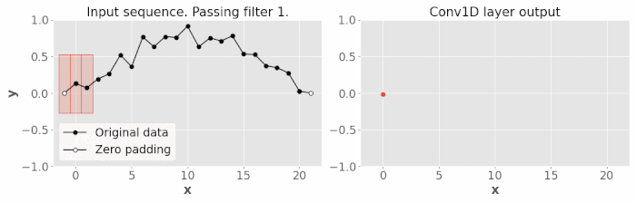
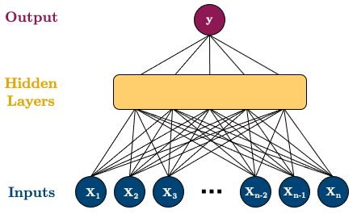
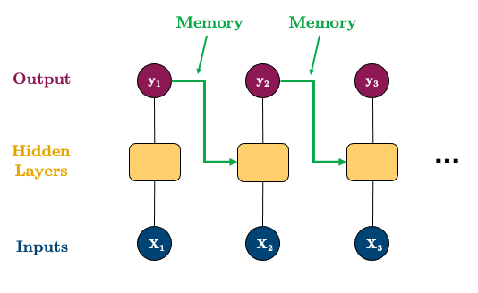
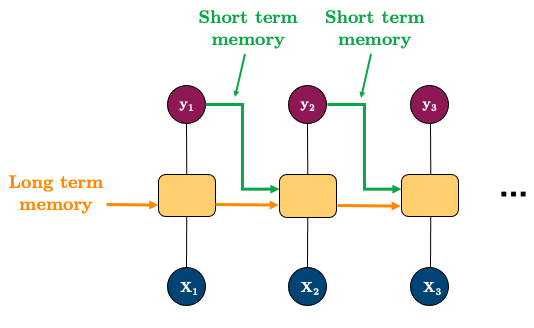

# Lecture 6: Advanced Time Series Modelling

## Deep Learning with Time Series

- Classical time series (ARIMA, Exponential Smoothing) limitations:

  - They are linear models
  - Inputs must be specified, not learned automatically
  - Focus on univariate time series (lack support for multivariate time series)
  - Focus on regression (lack support for classification)
  - Assumes complete, non-missing data

- Deep learning models can address these limitations, as NNs are:
  - robust to noise
  - can learn complex, non-linear relationships
  - support multivariate time series
  - feature learning (learn the inputs)
  - temporal dependencies can be learned

### Neural Networks

- NN allows us so that the features do not need to be ordered
  - e.g. target, lag1. lag2, lag3 is the same as lag2, lag3, target, lag1
- Need to take into account inherent temporal dependencies (approach above does not)
- Do something similar like CNN (retain spatial information) but for time series

### Convolutional Neural Networks (CNN)

- Can work with 3D data (channels, height, width)
- Can also do 2D data (features, time)
- Use `Conv1D` from `pytorch` to work with time series data
  - Looks at local groups of data (filter of some size)
  - Missing memory (does not remember previous values, only looks at local groups of data)
    - can be solved with RNN



_Image with sequence of 20 values, filtered with 4 kernels of size 3_

```python
import torch.nn.Conv1d
import pandas as pd
import plotly.express as px
from sktime.utils.data_processing import lag_df

conv_layer = nn.Conv1d(in_channels=1, out_channels=4, kernel_size=3, padding=1)

# Load data
train = (pd.read_csv("data/unemployed_train.csv", index_col=0, parse_dates=True)
           .resample("1M").mean()
           .assign(Label="Train")
        )
test = (pd.read_csv("data/unemployed_valid.csv", index_col=0, parse_dates=True)
           .resample("1M").mean()
           .assign(Label="Test")
        )

# Plot train and test data
px.line(pd.concat((train, test)), y="Unemployed persons", color="Label", width=600, title="Australian Unemployment")

# Make lag features
SEQUENCE_LENGTH = 24
BATCH_SIZE = 16
cnn_data = lag_df(train, lags=SEQUENCE_LENGTH, dropna=True)
cnn_data = cnn_data[cnn_data.columns[::-1]]  # Reverse columns to have lag0 at the end
```

- Then make CNN with optimizer `Adam` and loss function `MSE`

### Recurrent Neural Networks (RNN)

- Reasonable results with CNN because preserve structure of data
- **Structure**: - Split up and process one time-step at a time

   

- Great video on [RNNs](https://www.youtube.com/watch?v=LHXXI4-IEns&t=585s)
- Draw back: **Vanishing Gradient Problem**
  - Gradient becomes so small that it does not update the weights
  - Early time steps are not updated (long-term dependencies are not learned), they "forget"
  - Can be solved with LSTM and GRU

### Long Short-Term Memory (LSTM)



- Another great video on [LSTM](https://www.youtube.com/watch?v=8HyCNIVRbSU)
- All the yellow boxes (LSTM cells) are identical (same weights and architecture)

- **Components**:
  - **Cell State**: The horizontal line running through the top of the diagram
    - It runs straight down the entire chain, with only some minor linear interactions
  - **Forget Gate**: Decides what information to throw away from the cell state
  - **Input Gate**: Decides what new information to store in the cell state
  - **Output Gate**: Decides what to output based on the cell state

```python
from torch import nn

class LSTM(nn.Module):
    def __init__(self, input_size, output_size, hidden_dim):
        super().__init__()

        self.hidden_dim = hidden_dim
        self.lstm = nn.LSTM(input_size, hidden_dim, batch_first=True, num_layers=1)
        self.fc = nn.Linear(hidden_dim, output_size)

    def forward(self, x, hidden):
        # x :           (batch_size, seq_length, input_size)
        # hidden :      (short_mem, long_mem), each (n_layers, batch_size, hidden_dim)
        # output :  (batch_size, seq_length, input_size)
        # note that the output will have the same shape as the input because
        # it makes a forecast for each time step in the sequence
        # but we only care about the last prediction (the forecast after the sequence)
        # so I'll only take the last value of the output

        prediction, (short_mem, long_mem) = self.lstm(x, hidden)
        output = self.fc(prediction)
        return output[:, -1, :], short_mem, long_mem
```

- GRU is similar to LSTM, but has less parameters and is faster to train

### Useful Time Series Packages

#### Prophet (Facebook)

- Frankenstein of classical time series models (decomposition, regression, exponential smoothing, etc)

```python
import pandas as pd
from prophet import Prophet

# Sample data
data = pd.read_csv('example_data.csv')
data['ds'] = pd.to_datetime(data['ds'])

# Initialize Prophet model
model = Prophet(interval_width=0.95, yearly_seasonality=True, weekly_seasonality=True, daily_seasonality=True)

# Fit the model
model.fit(data)

# Make future predictions
test_dates = model.make_future_dataframe(periods=len(test), freq='M', include_history=False)
forecast = model.predict(test_dates)

# Visualize the forecast
fig = model.plot(forecast)
```

#### Other ML based time series packages

- GluonTS: alternative to pytorch.
- PyTorch Forecasting: built on top of pytorch, but with more focus on time series forecasting.
- sktime: scikit-learn for time series data.
- Tidyverts: R package for time series forecasting.

### Additional Topics

- **Heirarchical Time Series**: Forecasting at different levels of aggregation (e.g. product sales at store level, then at regional level, then at national level)
  - Bottom-up: Forecast at the lowest level and aggregate up
  - Top-down: Forecast at the highest level and disaggregate down
- **Multiple Seasonalities**: e.g. daily and weekly seasonality
  - decompose independently
  - decompose simultaneously (e.g. propher/ statsmodels)
- **Multivariate Time Series**: e.g. sales and advertising spend
  - VAR (Vector Auto Regression)
  - LSTM with multiple inputs
- **Explanatory variables**:
  - easy to add features to ML models
  - ARIMA can but using `exog` parameter
- **Time Series Classification**:
  - Hidden Markov Models
