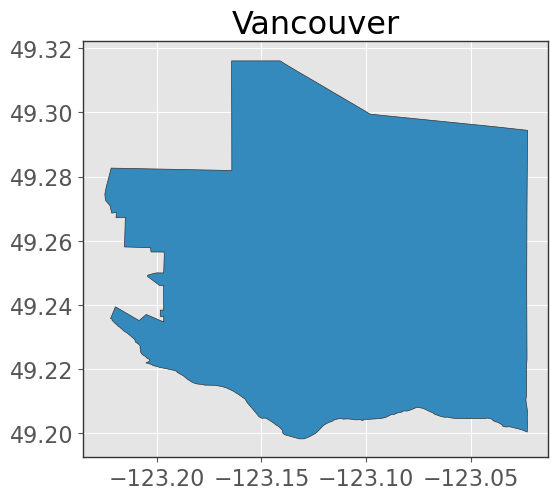
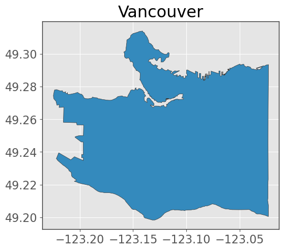
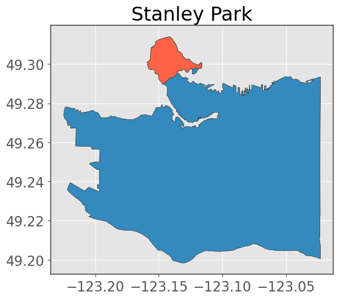

# Lecture 7: Introduction to Spatial Data

## Spatial Data

- Data with location information
- Has spacial dependence
- **Main Tasks**:
  - Wrangling
  - Visualization
  - Modelling
- **Representation**:
  - Vector
  - Raster

### Working with Vector Data

- Collection of discrete locations/ vertices `(x, y)` to form:
  - **Points**: single location
  - **Lines**: series of points
  - **Polygons**: series of lines (closed shape)
- Stored in `.shp` (shapefile) format
  - `.shp`: geometry
  - `.shx`: index (how geometry relates to one another)
  - `.dbf`: attributes (e.g. population, area)

#### Geopandas Intro

- To read and write vector data
- Built off of `pandas` and `shapely`
- Similar to `pandas` it has:
  - `GeoSeries`: series of geometries
  - `GeoDataFrame`: dataframe with geometry column
    - Geometry column contains vector data


```python
import geopandas as gpd

# Read data
gdf = gpd.read_file(“path/to/shp_dir”)

# Plot data
gdf.plot()
```

#### Making data with Geopandas

```python
import geopandas as gpd

lat = [49.2827, 49.2827, 49.2827, 49.2827]
lon = [-123.1207, -123.1207, -123.1207, -123.1207]

gdf = gpd.GeoDataFrame(geometry=gpd.points_from_xy(lon, lat))
gdf.plot()
```

#### Loading from OpenStreetMap

- It is like the wikipedia of geospacial data
- Use `osmnx` to get data from OpenStreetMap

```python
import osmnx as ox

vancouver = ox.geocode_to_gdf("Vancouver, Canada")
vancouver.plot(edgecolor="0.2")
plt.title("Vancouver");
```



```python
# get higher resolution
van_bc = gpd.clip(bc, vancouver)
van_bc.plot(edgecolor="0.2")
```



```python
# Plot stanley park in vancouver
stanley_park = ox.geocode_to_gdf("Stanley Park, Vancouver")
ax = van_bc.plot(edgecolor="0.2")
stanley_park.plot(ax=ax, edgecolor="0.2", color="tomato")
```



```python
# Graph bike network in vancouver
bike_network = ox.graph_from_place("Stanley Park, Vancouver",
    network_type="bike")

ax = stanley_park.plot(edgecolor="0.2")
bike_network.plot(ax=ax, edgecolor="0.2", color="tomato")

# can be interactive
bike_network.explore()
```


#### Wrangling with Geopandas

- **Add width to line**: `gdf.buffer(2)` to add a 2m to left and right of the line (4m total)
- **Get Length of line**: `gdf.length.sum()` to get the length of the line
  - Need to convert to linear meters first
- **Get Area of polygon**: `gdf.area.sum()` to get the area of the polygon
  - Need to convert to linear meters first
- **Joining**: `gpd.sjoin(gdf1, gdf2, how=‘left’, predicate=‘intersects’)`
  - `how`: left, right, inner, outer
  - `predicate`: intersects, contains, within, touches, crosses, overlaps
- **Grouping**: `gdf.groupby(by=‘column’).sum().sort_values("length", ascending=False)`

### Working with Raster Data


- Each pixel has 4 bands: Red, Green, Blue, and Infrared
- **Resolution**: size of each pixel (e.g. 1m x 1m)
  - smaller resolution = more detailed
- Most common format: GeoTIFF (`.tif`)
- Use Python library `rasterio` to read and write raster data

```python
import rasterio

dataset = rasterio.open(“path/to/raster.tif”)
```

### Coordinate Reference Systems (CRS)

- Typically identified by EPSG (European Petroleum Survey Group) code
- **Common CRS**:
  - **Angular units** (latitude and longitude): `EPSG:4326`
  - **Linear units** (meters): Most common is UTM which is divided into zones. For British Columbia, it’s `EPSG:32610`
  - **Minimize distortion** by choosing the right CRS, for Canada, it’s `EPSG:3347` ("Lambert projection")
- **Change code in geopandas:**`gdf.to_crs(“EPSG:3347”)`


