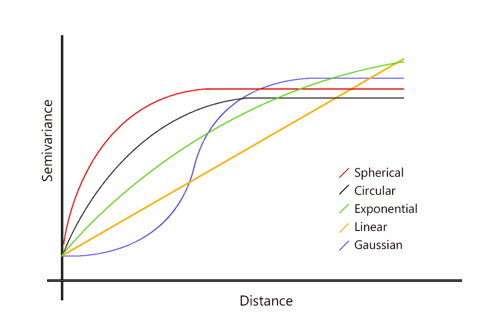

# Lecture 8: Visualizing and modeling spatial data

## Spatial Visualization

### Geopandas Plotting

- Easy to use and quick

1. Get data of UBC buildings from `osmnx`

```python
import osmnx as ox
import geopandas as gpd

ubc = (ox.features.features_from_place("University of British Columbia, Canada",
                                tags={'building':True}) # Just keep building footprints
         .loc[:, ["geometry"]]                 # just keep the geometry column for now
         .query("geometry.type == 'Polygon'")  # only what polygons (buidling footprints)
         .assign(Label="Building Footprints")  # assign a label for later use
         .reset_index(drop=True)               # reset to 0 integer indexing
        )
```

2. Get the building footprint of a specific building from its coordinates

```python
point_coord = Point(-123.25203756532703,49.26314716306668)

ubc[ubc.contains(point_office)] # get the building that contains the point

ubc.loc[47, "Label"] = "Earth Science Building" # change the label
```

3. Plot the GeoDataFrame

```python
ax = ubc.plot(figsize=(8, 8), column="Label", legend=True,
edgecolor="0.2", markersize=200, cmap="rainbow")
plt.title("UBC");

```

4. Add map to the background

```python
import contextily as cx

ax = (ubc.to_crs("EPSG:3857")
         .plot(figsize=(10, 8), column="Label", legend=True,
               edgecolor="0.2", markersize=200, cmap="rainbow")
     )

cx.add_basemap(ax, source=cx.providers.OpenStreetMap.Mapnik)  # I'm using OSM as the source. See all provides with ctx.providers
plt.axis("off")
plt.title("UBC");
```


### Plotly Express

- To add interactivity to the map
- Backed by MapBox (mapping and location data cloud platform)

```python
import plotly.express as px

# Does the same thing as the previous cell, but with plotly express (interactive)
fig = px.choropleth_mapbox(ubc,
                            geojson=ubc.geometry,
                            locations=ubc.index,
                            color="Label",
                            center={"lat": 49.261, "lon": -123.246},
                            zoom=12.5,
                            mapbox_style="open-street-map")
fig.update_layout(margin=dict(l=0, r=0, t=30, b=10))
```

- Can also plot the buildings with different colours based on building area

```python
# Calculate area
ubc["Area"] = ubc.to_crs(epsg=3347).area  # (https://epsg.io/3347)

# Make plot
fig = px.choropleth_mapbox(ubc,
                            geojson=ubc.geometry,
                            locations=ubc.index,
                            color="Area",
                            center={"lat": 49.261, "lon": -123.246},
                            zoom=12.5,
                            mapbox_style="carto-positron")
fig.update_layout(margin=dict(l=0, r=0, t=30, b=10))
```


### Kepler.gl

- Web-based geospatial analysis tool
- Even more powerful than Plotly Express
- How it works:
  1. Create instance of map with `keplergl.KeplerGl()`
  2. Add as much data with `.add_data()` method
  3. Customize and configure the map using GUI

```python
from keplergl import KeplerGl

ubc_map = keplergl.KeplerGl(height=500)
ubc_map.add_data(data=ubc.copy(), name="Building heights")

ubc_map
```

- Can also make a 3d map with building heights
  - Load the building heights data
  - Join the data with the building footprints
  - Plot the 3d map + addjust the GUI settings

## Spatial Modeling


Source: https://www.neonscience.org/resources/learning-hub/tutorials/spatial-interpolation-basics

- Two common ways to model spatial data:
  1. **Spatial interpolation**: use a set of observations in space to estimate the value of a spatial field
  2. **Areal interpolation**: project data from one set of polygons to another set of polygons
- “everything is related to everything else, but near things are more related than distant things” (Tobler, 1970)

### Deterministic Interpolation

- Use `scipy` module `interpolate` to do deterministic interpolation
- Common Techniques:

  1. **Inverse Distance Weighting (IDW)**: estimate the value of a point based on the values of its neighbours (farther neighbours have less weight)

  $$\hat{z}(x) = \frac{\sum_{i=1}^{n} w_i(x)z_i}{\sum_{i=1}^{n} w_i(x)}$$

  where $w_i(x) = \frac{1}{d_i(x)^p}$, $d_i(x)$ is the distance between $x$ and $i$, and $p$ is the power parameter

  2. **Nearest Neighbour**: estimate the value of a point based on the value of the nearest point (does not consider weights)

  - Less smooth than IDW (more jagged)

  3. **Polynomial Interpolation**: estimate the value of a point based on the values of its neighbours using a polynomial function
  4. **Radial Basis Function**: estimate the value of a point based on the values of its neighbours using a radial basis function

```python
from scipy.interpolate import NearestNDInterpolator

# Get the geodataframe
gpm25 = (gpd.GeoDataFrame(
            pm25,
            crs="EPSG:4326", # angular CRS
            geometry=gpd.points_from_xy(pm25["Lon"], pm25["Lat"])) # create geometry from coordinates
        .to_crs("EPSG:3347") # convert to one for Canada
        )

# Creates points to interpolate
gpm25["Easting"], gpm25["Northing"] = gpm25.geometry.x, gpm25.geometry.y

# Create a grid
resolution = 25000  # cell size in meters, smaller cell size = smaller pixel = higher resolution
gridx = np.arange(gpm25.bounds.minx.min(), gpm25.bounds.maxx.max(), resolution)
gridy = np.arange(gpm25.bounds.miny.min(), gpm25.bounds.maxy.max(), resolution)

# Interpolate
interpolator = NearestNDInterpolator(gpm25[["Easting", "Northing"]], gpm25["PM25"])
z = model(*np.meshgrid(gridx, gridy))
plt.imshow(z);
```

- Plot it back to map:

```python
# Helper function:
def pixel2poly(x, y, z, resolution):
    """
    x: x coords of cell
    y: y coords of cell
    z: matrix of values for each (x,y)
    resolution: spatial resolution of each cell
    """
    polygons = []
    values = []
    half_res = resolution / 2
    for i, j  in itertools.product(range(len(x)), range(len(y))):
        minx, maxx = x[i] - half_res, x[i] + half_res
        miny, maxy = y[j] - half_res, y[j] + half_res
        polygons.append(Polygon([(minx, miny), (minx, maxy), (maxx, maxy), (maxx, miny)]))
        if isinstance(z, (int, float)):
            values.append(z)
        else:
            values.append(z[j, i])
    return polygons, values
```

```python
polygons, values = pixel2poly(gridx, gridy, z, resolution)

pm25_model = (gpd.GeoDataFrame({"PM_25_modelled": values}, geometry=polygons, crs="EPSG:3347")
                 .to_crs("EPSG:4326")
             )

fig = px.choropleth_mapbox(pm25_model, geojson=pm25_model.geometry, locations=pm25_model.index,
                           color="PM_25_modelled", color_continuous_scale="RdYlGn_r", opacity=0.5,
                           center={"lat": 52.261, "lon": -123.246}, zoom=3.5,
                           mapbox_style="carto-positron")
fig.update_layout(margin=dict(l=0, r=0, t=30, b=10))
fig.update_traces(marker_line_width=0)
```

### Probabilistic Interpolation

- **Kriging** differs from deterministic because we interpolate using statistical models that include estimates of spatial autocorrelation

$$\hat{Z}(s_0) = \sum_{i=1}^{n} \lambda_i Z(s_i)$$

- $\lambda_i$ are the weights
- $Z(s_i)$ are observations at locations $s_i$
- $N$ is the size of $s$ (number of observations)
  </br>
- Kriging uses spatial autocorrelation to estimate the weights
  - Looking at the variance between points to estimate the weights

#### Variogram

- Defines the spatial variance/ autocorrelation between points (as a function of distance)
  - Similar to ACF but for spatial data
- Used to estimate the weights in kriging
- e.g. of a function: $\gamma(s_i, s_j) = \frac{1}{2}(Z(s_i) - Z(s_j))^2$
  - semi-variance because of a factor of 1/2
  - Each pair is calculated twice
- Plot this function to get the variogram (x-axis: distance, y-axis: semivariance)


- **Nugget**: variance at distance 0
  - Ideally should be 0 (no variance at distance 0), higher nugget = more noise
  - Can be thought of as Random error/ measurement error
- **Sill**: maximum variance of spatial process
  - represents the amount of spatial autocorrelation that exists at large enough distances to capture the underlying trend of the process
- **Range**: where the semivariance reaches the sill



#### Kriging with `pykrige`

```python
from pykrige.ok import OrdinaryKriging

RESOLUTION = 250  # m

# 1. Convert to meter-based
van_listings_gdf = van_listings_gdf.to_crs("EPSG:3347")

# 2. Add Easting and Northing columns
van_listings_gdf["Easting"] = van_listings_gdf.geometry.x
van_listings_gdf["Northing"] = van_listings_gdf.geometry.y

# 3. Create a grid of points
gridx = np.arange(
    van_listings_gdf.bounds.minx.min(), van_listings_gdf.bounds.maxx.max(), RESOLUTION
)
gridy = np.arange(
    van_listings_gdf.bounds.miny.min(), van_listings_gdf.bounds.maxy.max(), RESOLUTION
)

# 4. Kriging
krig = OrdinaryKriging(
    x=van_listings_gdf["Easting"],
    y=van_listings_gdf["Northing"],
    z=van_listings_gdf["price"],
    variogram_model="spherical",
    verbose=False,
    enable_plotting=False,
)

# 5. Execute and plot
z, ss = krig.execute("grid", gridx, gridy)
plt.imshow(z)
```

### Areal Interpolation

- Project data from one set of polygons to another set of polygons
- E.g. Map air pollution data fo FSA (“forward sortation area”, which are groups of postal codes) polygons

```python
# Load the FSA data
van_fsa = gpd.read_file("data-spatial/van-fsa")

# Kriging (similar to previous cell)
resolution = 10_000  # cell size in meters
gridx = np.arange(gpm25.bounds.minx.min(), gpm25.bounds.maxx.max(), resolution)
gridy = np.arange(gpm25.bounds.miny.min(), gpm25.bounds.maxy.max(), resolution)
krig = OrdinaryKriging(x=gpm25["Easting"], y=gpm25["Northing"], z=gpm25["PM_25"], variogram_model="spherical")
z, ss = krig.execute("grid", gridx, gridy)
polygons, values = pixel2poly(gridx, gridy, z, resolution)
pm25_model = (gpd.GeoDataFrame({"PM_25_modelled": values}, geometry=polygons, crs="EPSG:3347")
                 .to_crs("EPSG:4326")
                 )
z, ss = krig.execute("grid", gridx, gridy)

# Areal Interpolation
areal_interp = area_interpolate(pm25_model.to_crs("EPSG:3347"),
                                van_fsa.to_crs("EPSG:3347"),
                                intensive_variables=["PM_25_modelled"]).to_crs("EPSG:4326")
areal_interp.plot(column="PM_25_modelled", figsize=(8, 8),
                  edgecolor="0.2", cmap="RdBu", legend=True)
plt.title("FSA Air Pollution");
```


### Shortest Path Analysis

- Use **Dijkstra's algorithm** to find the shortest path between two points
- Condition:
  - The graph must be weighted with non-negative weights
- **Algorithm**:
  1. Label start node with 0, all others with infinity
  2. Label current node as visited
  3. Go to all connected nodes (to current) and update label with `min(current_label, previous_label + weight)`
  - If updated, then keep track of the previous node (for backtracking later)
  4. Once all nodes around the current node are visited, go to the unvisited node with the smallest label and repeat step 2
  5. Backtrack from end node to start node using the previous node
- Time complexity: $O(V^2)$ but its $O(E + V \log V)$ with a min-priority queue/ binary heap
- Space complexity: $O(V)$

```python
import osmnx as ox
import networkx as nx

# Origin
orig_address = "UBC bookstore, Vancouver"
orig_y, orig_x = ox.geocode(orig_address)  # notice the coordinate order (y, x)!

# Destination
dest_address = "Orchard Commons Student Residence, Vancouver"
dest_y, dest_x = ox.geocode(dest_address)

# Find the nearest nodes
orig_node_id, dist_to_orig = ox.distance.nearest_nodes(G, X=orig_x, Y=orig_y, return_dist=True)
dest_node_id, dist_to_dest = ox.distance.nearest_nodes(G, X=dest_x, Y=dest_y, return_dist=True)

# Find the shortest path
route = nx.shortest_path(G, orig_node_id, dest_node_id, weight="length")

# Plot the shortest path
ox.plot.plot_graph_route(G, route)
```
