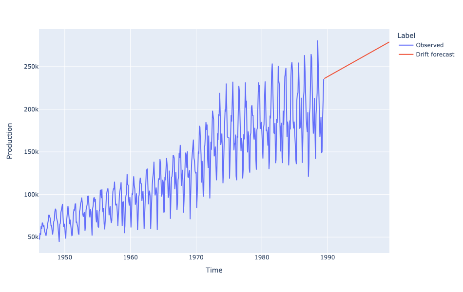
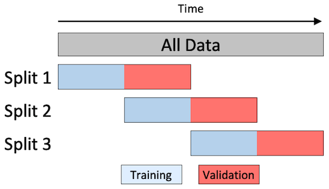

# 574 Quiz 1

## Time Series

- Collection of observations made sequentially in time
- Data Types:
  - **Univariate**: Single observation at each time point (e.g. bike sale over time)
  - **Multivariate**: Multiple observations at each time point (e.g. bike sale + profit over time)
  - **Heirarchical**: Multiple time series, each with a hierarchical structure (e.g. bike sale + profit for each store over time)
- Common Tasks:
  - **Prediction/ Forecasting** (Supervised Learning)
    - Difficult since many factors
  - **Clustering/ Anomaly Detection** (Unsupervised Learning)

### Features of Time Series

#### Temporal Dependence

- Observations close in time are often correlated
  - Can quanitify using **autocorrelation**
- **Autocorrelation**: Correlation of a time series with a lagged version of itself
  - **Lag**: Time difference between two observations
  - **ACF**: Autocorrelation function
    - Plots autocorrelation for different lags
  - **PACF**: Partial autocorrelation function
    - Plots correlation between two observations after removing the effect of other lags
  - e.g. `data[t (lag=1)] = data[t].shift(t)`

##### Correlogram

- Plot of ACF vs. lag
- Helps identify patterns in time series
- Use `statsmodels.graphics.tsaplots.plot_acf()`


- Shading indicates if correlation is significantly different from 0

  - $CI = \pm z_{\alpha/2} SE(r_k)$, $z_{\alpha/2} \approx 1.96$ for 95% CI
  - $SE(r_k) = \frac{1}{\sqrt{T}}$, where $T$ is the number of observations - Or Bartlett's formula: $SE(r_k) = \sqrt{\frac{1 + 2\sum_{j=1}^{k-1}r_j^2}{T}}$
    </br>

- CO2 plot has a trend so ACF for smaller lags tend to be higher
- **General Key Observations**:
  1. ACF almost always decays with lag
  2. If a series alternates (oscillates about mean), ACF will alternates too
  3. If a series has seasonal or cyclical fluctuations, the ACF will oscillate at the same frequency
  4. If there is a trend, ACF will decay slower (due to high correlation of the consecutive observations)
  5. Experience is required to interpret ACF

#### Time Series Patterns

1. **Trend**: Long-term increase/ decrease
2. **Seasonality**: Regular pattern of up and down fluctuations (fixed interval)
   - typically over smaller time frame
3. **Cyclic**: Fluctuations not of fixed period (unknown and changing interval)
   - typically over larger time frame

#### White Noise

- Time series with: 0 mean, constant variance, no autocorrelation
- Further assumed that it is iid and gaussian: $N(0, \sigma^2)$

- **Why do we care?**
  - Cannot predict white noise
  - If residuals from time series for a forecast should resemble white noise
    - Implies that the model has captured all the information in the data

### Time Series Decomposition

- When we decompose, we split the time series into 3 components:

  1. **Trend-cycle (T)**: Long-term increase/ decrease
  2. **Seasonal (S)**: same as seasonal above
  3. **Residual**: Random fluctuations


- **Additive Model**: $Y_t = T_t + S_t + R_t$
  - When the magnitude of the seasonal fluctuations **does not change** with the level of the time series
- **Multiplicative Model**: $Y_t = T_t \times S_t \times R_t$
  - When the magnitude of the seasonal fluctuations **does change** with the level of the time series

#### Estimating the Trend

1. **Curve Fitting**: Fit a polynomial of degree $n$ to the time series

   ```python
   detrended = data - detrend(data, order=2) # order=2 for quadratic
   ```

2. **Moving Average**: Smooths out short-term fluctuations and highlights longer-term trends

   ```python
   # rolling is a pandas function
   rolling_mean = df.rolling(window=5, center=True).mean()
   # For even window, common practice to do:
   window = 4
   df.rolling(window).mean().rolling(2).mean().shift(-window//2)
   ```

   - `window`: Number of observations used for calculating the statistic
   - `center`: Set the labels at the center of the window
     - if odd, the label is at the center
     - if even, the label is at the right

#### Estimating Seasonality

- Simple steps:
  1. Remove the trend from the data (the detrended data above)
  2. Estimate the seasonal component by averaging the detrended data over each season

#### Estimating the Residual

- The residual is the remainder after removing the trend and seasonal components
- If additive model: $R_t = Y_t - T_t - S_t$
- If multiplicative model: $R_t = \frac{Y_t}{T_t \times S_t}$
- Use `seasonal_decompose` from `statsmodels.tsa.seasonal` to do all of this

## Forecasting

1. **Average**: Use average of all past observations
2. **Naive**: Use the last observation as the forecast
3. **Seasonally Adjusted Naive**: Same as Naive but with seasonally adjusted data (classical decomposition)
   

4. **Seasonally Naive**: Use the last observation from the same season (only one with seasonality)
   

5. **Drift**: Linearly extrapolate the trend (only one that is not a straight horizontal line)



### Exponential Models

#### Simple Exponential Smoothing

- Forecast is a weighted average of all past observations
- Recursively defined: $\hat{y}_{t+1|t} = \alpha y_t + (1 - \alpha) \hat{y}_{t|t-1}$
- **$\alpha$: Smoothing parameter**
  - Close to 0: More weight to past observations
  - Close to 1: More weight to current observation (closer to Naive forecast)
- **Initial Forecast**:
  - $\hat{y}_{1|0} = y_1$
  - Heuristic: linear interpolation of the first few observations
  - Learn it by optimizing SSE
- Forecasts are flat

#### Holt's Method

- Extend SES to include a trend component
  $$\hat{y}_{t+h|t} = \ell_t + h b_t$$

  $$\ell_t = \alpha y_t + (1 - \alpha)(\ell_{t-1} + b_{t-1})$$

  $$b_t = \beta(\ell_t - \ell_{t-1}) + (1 - \beta)b_{t-1}$$

- $\ell_t$: Level
- $b_t$: Smoothness of the trend
  - Close to 0: Trend is more linear
  - Close to 1: Trend changes with each observation
- $\alpha$: Smoothing parameter for level

#### Holt's Winter Method

- Extend Holt's method to include a seasonal component
  $$\hat{y}_{t+h|t} = \ell_t + h b_t + s_{t-m+h_m}$$

  $$b_t = \beta(\ell_t - \ell_{t-1}) + (1 - \beta)b_{t-1}$$

- For Additive Seasonal:
  $$\ell_t = \alpha(y_t - s_{t-m}) + (1 - \alpha)(\ell_{t-1} + b_{t-1})$$

  $$s_t = \gamma(y_t - \ell_{t-1} - b_{t-1}) + (1 - \gamma)s_{t-m}$$

- For Multiplicative Seasonal:
  $$\ell_t = \alpha\frac{y_t}{s_{t-m}} + (1 - \alpha)(\ell_{t-1} + b_{t-1})$$

  $$s_t = \gamma\frac{y_t}{\ell_{t-1} + b_{t-1}} + (1 - \gamma)s_{t-m}$$

| Trend component        | Seasonal Component   |
| ---------------------- | -------------------- |
| None `(N)`             | None `(N)`           |
| Additive `(A)`         | Additive `(A)`       |
| Additive Damped `(Ad)` | Multiplicative `(M)` |

- Simple Exponential Smoothing `(N,N)`
- Holt's Method `(A,N)`
- Holt's Winter Method `(A,A)`

#### ETS (Error, Trend, Seasonal) Models

- Components:

  - Error: `{A, M}`
  - Trend: `{N, A, Ad}`
  - Seasonal: `{N, A, M}`

- Can generate prediction intervals (confidence intervals):
  1. `model.get_prediction()` (analytical)
  2. `model.simulate()`

### Selecting a Model

- **Metrics**, Commonly used:
  - AIC, BIC
  - SSE/ MSE/ RMSE
- **Residuals**:
  - Visual inspection (should be uncorrelated, zero mean, normally distributed)
  - Running diagnostic Portmanteau tests:
    - **Ljung-Box Test**: $H_0$: Residuals are uncorrelated (white noise)
      - p-value < 0.05: Reject $H_0$ (bad)
    - **Jarque-Bera Test**: $H_0$: Residuals are normally distributed
      - p-value < 0.05: Reject $H_0$ (bad)
- **Out-of-sample Forecasting**:
  - Split data into training and testing
  - Fit model on training data
  - Forecast on testing data
  - Compare forecast with actuals

## ARIMA Models

- **ARIMA**: AutoRegressive Integrated Moving Average
- Commonly used for time series forecasting (other than exponential smoothing)
- Based on autocorrelation of data
- Do not model trend nor seasonality, so it is typically constrained to **stationary** data

### Stationarity

- Statistical properties of a time series do not change over time
  - Mean, variance is constant
  - Is roughly horizontal (no strong trend)
  - Does not show predictable patterns (no seasonality)
- DOES not mean that the time series is constant, just that the way it changes is constant
- It is one way of modelling dependence structure
  - Can only be independent in one way but dependent in many ways

#### Strong vs Weak Stationarity

| Property                                  | Strong Stationarity | Weak Stationarity        |
| ----------------------------------------- | ------------------- | ------------------------ |
| Mean, Variance, Autocovariance            | Constant            | Constant                 |
| Higher order moments (skewness, kurtosis) | Constant            | Not necessarily constant |

- Weak stationarity is often sufficient for time series analysis

### Checking for Stationarity

1. **Visual Inspection**: Plot the time series
   - Look for trends, seasonality, and variance (none of these should be present)
   - Make a correlogram plot (ACF plot should rapidly decay to 0)
2. **Summary Statistics**: Calculate mean, variance, and autocovariance
   - Mean and variance should be roughly constant over time
3. **Hypothesis Testing**: Use statistical tests
   - **Augmented Dickey-Fuller (ADF) test/ AdFuller**
     - Null hypothesis: Time series is non-stationary
     - small p: it is stationary (reject null)
     - Use `statsmodels.tsa.stattools.adfuller`
   - **Kwiatkowski-Phillips-Schmidt-Shin (KPSS) test**
     - Null hypothesis: Time series is stationary
     - small p: it is non-stationary (reject null)

### Making a Time Series Stationary

- **Stabilizing the variance using transformations**

  - Log or box-cox transformation

  $$w_t = \begin{cases} \frac{y_t^\lambda - 1}{\lambda} & \text{if } \lambda \neq 0 \\ \ln(y_t) & \text{if } \lambda = 0 \end{cases}$$

- **Stabilize the mean using differencing**

  - First difference: $y' = y_t - y_{t-1}$
  - Second difference: $y'' = y' - y'_{t-1} = y_t - 2y_{t-1} + y_{t-2}$
  - Seasonal difference: $y' = y_t - y_{t-m}$, where $m$ is the seasonal period

### AR and MA Models

| AR (AutoRegressive) Model                                                      | MA (Moving Average) Model                                                                                 |
| ------------------------------------------------------------------------------ | --------------------------------------------------------------------------------------------------------- |
| Regression of the time series on its own lagged values                         | Regression of the time series on past forecast errors                                                     |
| $y_t = \phi_1 y_{t-1} + \phi_2 y_{t-2} + \ldots + \phi_p y_{t-p} + \epsilon_t$ | $y_t = \epsilon_t + \theta_1 \epsilon_{t-1} + \theta_2 \epsilon_{t-2} + \ldots + \theta_q \epsilon_{t-q}$ |
| $p$: order of the AR model                                                     | $q$: order of the MA model                                                                                |
| $\phi$: AR coefficients                                                        | $\theta$: MA coefficients                                                                                 |
| $\epsilon_t$: white noise                                                      | $\epsilon_t$: white noise                                                                                 |
| **Long memory model**: $y_1$ has a direct effect on $y_t$ for all $t$          | **Short memory model**: $y_t$ is only affected by recent values of $\epsilon$                             |
| Good for modeling time-series with dependency on past values                   | Good for modeling time-series with a lot of volatility and noise                                          |
| Less sensitive to choice of lag or window size                                 | More sensitive to choice of lag or window size                                                            |

- Both values are between -1 and 1
- AR value of 1 means that the time series is a random walk

### ARMA Model

- **ARMA**: AutoRegressive Moving Average
- Combines AR and MA models
- Key Idea: Parsimony
  - fit a simpler, mixed model with fewer parameters, than either a pure AR or a pure MA model

$$y_t = c + \phi_1 y_{t-1} + \phi_2 y_{t-2} + \ldots + \phi_p y_{t-p} + \epsilon_t + \theta_1 \epsilon_{t-1} + \theta_2 \epsilon_{t-2} + \ldots + \theta_q \epsilon_{t-q}$$

- $\phi$: AR coefficients, $\theta$: MA coefficients
- Usually write it as `ARMA(p, q)`

### ARIMA Model

- **ARIMA**: AutoRegressive Integrated Moving Average
- Combines ARMA with differencing
- `ARIMA(p, d, q)`
  - `p`: order of the AR model
  - `d`: degree of differencing
  - `q`: order of the MA model
- Use `statsmodels.tsa.arima.model.ARIMA`
- Hyperparameter tune using `pmdarima.auto_arima`

#### SARIMA

- **SARIMA**: Seasonal ARIMA
- `SARIMA(p, d, q)(P, D, Q, m)`

  - `p`, `d`, `q`: ARIMA parameters
  - `P`, `D`, `Q`: Seasonal ARIMA parameters
  - `m`: seasonal period

- Also have **SARIMAX** (with exogenous variables)
  - adds exogenous variables (other time series) to the model
  - Not the most effective model

### Choosing Orders

- **ACF and PACF plots**
  - ACF: Autocorrelation Function
  - PACF: Partial Autocorrelation Function
  - Use these to determine the order of the AR and MA models

| ACF Plot                                                          | PACF Plot                                                                     |
| ----------------------------------------------------------------- | ----------------------------------------------------------------------------- |
| Measures correlation between an observation and its lagged values | same but removes intermediate correlations (kinda isolates the direct effect) |
| For **MA(q)**, cuts off after lag q                               | For **AR(p)**, cuts off after lag p                                           |
| Else, tails off (exp or like damped sin)                          | Else, tails off (no clear pattern)                                            |

- See the cutoff when the peaks are lower than the shaded region

## Time Series Forecasting in ML

### Key Differences vs. Traditional ML

| Traditional ML          | Time Series ML                   |
| ----------------------- | -------------------------------- |
| Data is IID             | Data is ordered                  |
| CV is random            | Use sliding window CV            |
| Use feature engineering | Use lags, rolling windows, etc.  |
| Predict new data        | Predict future (specify horizon) |

### `sktime` Library

1. Load Data
2. Feature Engineering: shift/ lag
3. Train-Test Split
   1. Use `sktime.split.temporal_train_test_split` or `sklearn.model_selection.train_test_split` but with `shuffle=False`
4. CV with time series
   1. **Expanding Window**: start with small training set and increase it
      
   2. **Fixed/sliding Window**: use a fixed window size
      
5. Model Fitting
6. Forecasting

### Forecasting Strategies

1. **One-step forecasting**: one step ahead
2. **Multi-step forecasting**: multiple steps ahead
   a. **Recursive strategy**: predict `t`, then it becomes part of the input for `t+1`
   b. **Direct strategy**: have a model for each step (model for `t+1`, another for `t+2`, etc)
   c. **Hybrid strategy**: is dumb and bad
   d. **Multi-output strategy**: 2 different series (e.g. temperature and humidity)

- Use `make_reduction`: `make_reduction(regressor, window_length=12, strategy="recursive")`

### Feature Preprocessing and Engineering

#### Preprocessing

1. Coerce to stationary (via diff or transforms)
2. Smoothing (e.g. moving average)
3. Impute missing value (e.g. linear interpolation)
4. Removing outliers

#### Feature Engineering

1. Lagging features/ responses
2. Adding time stamps (e.g. day of week, month, etc)
   3, Rolling Statistics (e.g. rolling mean, rolling std)

### Multivariate Time Series

- Means time series with multiple variables (e.g. temperature and humidity)
