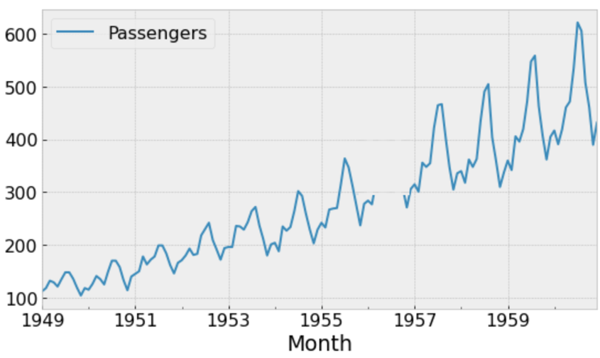
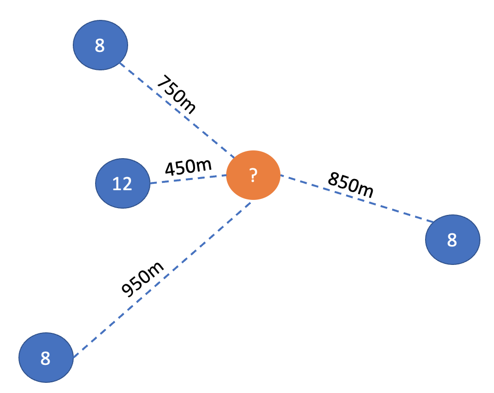

# Quiz 2 Practice

#### 1. Explain how can we compute prediction intervals from bootstrapped residuals and state your assumptions

- From the bootstrap samples, we find the 2.5% and 97.5% quantiles of the bootstrapped residuals. These will then be our lower and upper bounds of the prediction interval. We assume that the residuals are normally distributed and that the model is correctly specified.

#### 2. How to impute below



- I would use model fitted values (e.g. ARIMA) to impute the missing values. The model fitted values are the best estimates of the missing values.
- I would use MICE from statsmodels.

#### 3. Explain the main difference between a Convolution Neural Network (CNN) and a Recurrent Neural Network (RNN)

- RNN are used for sequential data because it has memory. CNN just looks at groups of data together.

#### 4. Tasks for RNN

[] Image classification
[x] Time series forecasting
[] Face recognition
[x] Speech recognition

#### 5. Give two examples of real-life applications of spatial interpolation

- Weather forecasting
- Urban planning
- Soil Science (Agriculture)
- Elevations (Topography)
- Air quality monitoring

#### 6. Explain how you can use STL decomposition to detect outliers from the following time-series (assuming a seasonal period = 12). Please explicitly outline the steps that would you undertake.

1. Decompose using STL decomposition to find residual ssince there is changing seasonality.
2. Calculate the 0.1 and 0.9 quantiles of the residuals.
3. Identify outliers as $2 \times (q_{0.9} - q_{0.1})$

#### 7. Write code to retrieve the city of Ottawa, Canada from open street map using the geocode_to_gdf() function from the osmnx package and compute its area in

(divide the area in
by 1000000).

Note: Pay attention to the coordinate reference systems (CRS).

```python
import osmnx as ox

ottawa = ox.geocode_to_gdf('Ottawa, Canada').to_crs("EPSG:32610")
ottawa.area = ottawa.area / 1000000 # m^2 to km^2
```

#### 8.Using the inverse distance weighted interpolation with a power p=2, compute the value for the missing location below. Show your work



$$\frac{\frac{8}{750^2} + \frac{12}{450^2} + \frac{8}{950^2} + \frac{8}{850^2}}{\frac{1}{750^2} + \frac{1}{450^2} + \frac{1}{950^2} + \frac{1}{850^2}} = 10.14$$
