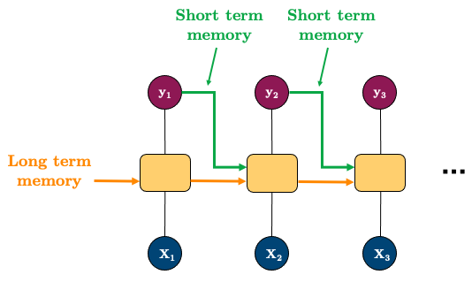

# Quiz 2 - 574

## Probabilistic Forecasting

- We have been dealing with **point forecasts** (modelling averages)
- Want to estimate the **uncertainty** of our forecasts
  - or the extreme (e.g. 90% or 95% quantiles)
    - example: find upper quantile of electricity demand so that we can plan for the maximum demand
  - or predict the variance of the forecast (how volatile a metric will be in the future)

### Analytical

- Assume distribution of forecasts are normal

$$
\hat{y}_{T+h|T} \pm c \hat{\sigma}_{h}
$$

- $\hat{\sigma}_{h}$ is the standard deviation of the forecast
- $c$: coverage factor (e.g. 1.96 for 95% confidence interval)

$$
\hat{\sigma}_{h} = \sqrt{\frac{1}{T-K}\sum_{t=1}^{T} e_{t}^{2}}
$$

- Focus is finding $\hat{\sigma}_{h}$
  - $K$: number of parameters
  - $T$: total length of time series
  - $e_{t} = y_{t} - \hat{y}_{t|t-1}$
- Methods that have been derived mathematically:

  | Method         | Forecast sd                                                  |
  | -------------- | ------------------------------------------------------------ |
  | Mean           | $\hat{\sigma}_{h} = \hat{\sigma_1} \sqrt{1 + \frac{h}{T}}$   |
  | Naive          | $\hat{\sigma}_{h} = \hat{\sigma_1} \sqrt{h}$                 |
  | Seasonal Naive | $\hat{\sigma}\_{h} = \hat{\sigma_1} \sqrt{\frac{h-1}{m}+1} $ |
  | Drift          | $\hat{\sigma}_{h} = \hat{\sigma_1} \sqrt{h(1+\frac{h}{T})}$  |

- _Recall: $h$ is the forecast horizon (steps ahead), $m$ is the seasonal period_


### Simulation and Bootstrapping

- Assume future errors will be similar to past errors
- Draw from the distribution of past errors to simulate future errors

$$y_{T+h} = \hat{y}_{T+h|T} + \epsilon_{T+h}$$

### Quantile Regression

- Wish to predict particular quantile instead of mean
  - e.g $q=0.9$ so we expect 90% of the future values to be below the forecast
- Pinball loss/ Quantile loss:
  $$
  \mathcal{L}=
       \left\{
  \begin{array}{ll}
        (1-q)(\hat{y}_{t,q}-y_t) \text{,} \;\; \text{ if } y_t < \hat{y}_{t,q} \\
        q(y_t-\hat{y}_{t,q}) \text{,} \;\;\;\;\;\;\;\;\;\; \text{ if } y_t \ge \hat{y}_{t,q} \\
  \end{array}
  \right.
  $$

| High Quantile                          | Low Quantile                            |
| -------------------------------------- | --------------------------------------- |
| Higher penalty for predicting **OVER** | Higher penalty for predicting **UNDER** |

#### Quantile Regression in PyTorch

see [here](https://pages.github.ubc.ca/MDS-2023-24/DSCI_574_spat-temp-mod_instructors/lectures/lecture5_uncertainty.html#quantile-regression)

Quantile loss is not currently a supported criterion in pytorch but it’s easy to define ourselves. We really have two options:

- Train a network for each quantile we want to predict; or
- Train a network to output multiple quantiles at once

### Evaluating Distributional Forecast Accuracy

- There are 4 main sources of uncertainty:

  1. Random error term
  2. Uncertainty in model parameter estimates
  3. Uncertainty in model selection
  4. Uncertainty about consistency of data generating process in the future

- Most methods only consider the first source of uncertainty
- Simulation tries to consider 2 and 3
- 4 is practically impossible to consider

## Anomaly Detection

- Outliers are observations that are significantly different from the rest of the data
  - Can be due to measurement error, data entry error, or just unique observations

### Rolling Median

- **Methodology**:
  1. Subtract the rolling median from data (with suitable window size)
  2. Calculate standard deviation of the residuals ($\hat{\sigma_r}$)
  3. Assume normally distributed residuals then identify outliers as outside the 95% confidence interval ($\pm 1.96 \hat{\sigma_r}$)

### STL Decomposition

- **Methodology**:
  1. Decompose time series to find residuals:
     - Non-seasonal data: use LOESS
     - Seasonal data: use STL (Seasonal-Trend decomposition using LOESS)
  2. Calculate $q_{0.1}$ and $q_{0.9}$ of the residuals
  3. Identify outliers as $\pm2 \times (q_{0.9} - q_{0.1})$

### Model-based

- **Methodology**:
  1. Fit a model to the data
  2. Identify outliers as significant deviations from model predictions (e.g. 95% confidence interval)

### ML approaches

- Train an ML model to predict outliers
- A few common packages: pyod, sklearn, luminaire, sklyline, etc.

#### Isolation Forest

- Built on basis of decision trees
- **High-level idea**:
  - randomly select a feature
  - randomly splits that feature into 2 values
  - repeat until all data points are isolated
- Less splits to isolate a data point = more likely to be an outlier
- Score = [0, 1] where 1 is an outlier, > 0.5 are normal observations.


#### K-NN

- For each data point, calculate the distance to its k-th nearest neighbor
  - Large distance = outlier
- Supports 3 kNN detectors:
  1. Largest: distance to the k-th neighbor
  2. Mean: average distance to k neighbors
  3. Median: median distance to k neighbors
- pyod's `KNN()` outlier detection

### Global vs Local Outliers

- **Global outliers**: A data point with its value is far outside of the entirety of the data set (e.g., billionaires)

- **Local/Contextual outliers**: A data point is considered a contextual outlier if its value significantly deviates from the rest the data points in the same context. (e.g., earning 50K income in a developing countries)

## Imputation

- **Imputation**: Filling in missing values/ outliers in a dataset
- Overarching techniques:
  1. Remove (`.dropna()`)
  2. Fill manually based on some expert-interpreted values (`.fillna()`)
  3. Fill with mean/median/mode (`.fillna()`)
  4. Fill based on rolling statistic, e.g. rolling mean/median
  5. Polynomial interpolation
  6. Fill based on temporal dependence
     - i.e. use same value from the same period last season, or average of all periods in the past season
  7. Fill with model fitted values
  8. Use `MICE` (Multiple Imputation by Chained Equations) from `statsmodels` or `IterativeImputer` from `sklearn`.

# Deep Learning with Time Series

- Classical time series (ARIMA, Exponential Smoothing) limitations:

  - They are linear models
  - Inputs must be specified, not learned automatically
  - Focus on univariate time series (lack support for multivariate time series)
  - Focus on regression (lack support for classification)
  - Assumes complete, non-missing data

- Deep learning models can address these limitations, as NNs are:
  - robust to noise
  - can learn complex, non-linear relationships
  - support multivariate time series
  - feature learning (learn the inputs)
  - temporal dependencies can be learned

### Neural Networks

- NN allows us so that the features do not need to be ordered
  - e.g. target, lag1. lag2, lag3 is the same as lag2, lag3, target, lag1
- Need to take into account inherent temporal dependencies (approach above does not)
- Do something similar like CNN (retain spatial information) but for time series

### Convolutional Neural Networks (CNN)

- Can work with 3D data (channels, height, width)
- Can also do 2D data (features, time)
- Use `Conv1D` from `pytorch` to work with time series data
  - Looks at local groups of data (filter of some size)
  - Missing memory (does not remember previous values, only looks at local groups of data)
    - can be solved with RNN


_Image with sequence of 20 values, filtered with 4 kernels of size 3_

- Then make CNN with optimizer `Adam` and loss function `MSE`

### Recurrent Neural Networks (RNN)

- Reasonable results with CNN because preserve structure of data
- **Structure**: - Split up and process one time-step at a time

   

- Great video on [RNNs](https://www.youtube.com/watch?v=LHXXI4-IEns&t=585s)
- Draw back: **Vanishing Gradient Problem**
  - Gradient becomes so small that it does not update the weights
  - Early time steps are not updated (long-term dependencies are not learned), they "forget"
  - Can be solved with LSTM and GRU

### Long Short-Term Memory (LSTM)



- All the yellow boxes (LSTM cells) are identical (same weights and architecture)

- **Components**:

  - **Cell State**: The horizontal line running through the top of the diagram
    - It runs straight down the entire chain, with only some minor linear interactions
  - **Forget Gate**: Decides what information to throw away from the cell state
  - **Input Gate**: Decides what new information to store in the cell state
  - **Output Gate**: Decides what to output based on the cell state

- GRU is similar to LSTM, but has less parameters and is faster to train

### Useful Time Series Packages

- Prophet: Facebook's time series forecasting package
- GluonTS: alternative to pytorch.
- PyTorch Forecasting: built on top of pytorch, but with more focus on time series forecasting.
- sktime: scikit-learn for time series data.
- Tidyverts: R package for time series forecasting.

### Additional Topics

- **Heirarchical Time Series**: Forecasting at different levels of aggregation (e.g. product sales at store level, then at regional level, then at national level)
  - Bottom-up: Forecast at the lowest level and aggregate up
  - Top-down: Forecast at the highest level and disaggregate down
- **Multiple Seasonalities**: e.g. daily and weekly seasonality
  - decompose independently
  - decompose simultaneously (e.g. propher/ statsmodels)
- **Multivariate Time Series**: e.g. sales and advertising spend
  - VAR (Vector Auto Regression)
  - LSTM with multiple inputs
- **Explanatory variables**:
  - easy to add features to ML models
  - ARIMA can but using `exog` parameter
- **Time Series Classification**:
  - Hidden Markov Models

# Spatial Data

- Data with location information (Has spacial dependence)
- **Main Tasks**: Wrangling, Visualization, Modelling
- **Representation**: Vector, Raster

## Working with Vector Data

- Collection of discrete locations/ vertices `(x, y)` to form:
  - **Points**: single location
  - **Lines**: series of points
  - **Polygons**: series of lines (closed shape)
- Stored in `.shp` (shapefile) format
  - `.shp`: geometry
  - `.shx`: index (how geometry relates to one another)
  - `.dbf`: attributes (e.g. population, area)

### Geopandas Intro

- To read and write vector data
- Built off of `pandas` and `shapely`
- Similar to `pandas` it has:
  - `GeoSeries`: series of geometries
  - `GeoDataFrame`: dataframe with geometry column
    - Geometry column contains vector data

### Loading from OpenStreetMap

- It is like the wikipedia of geospacial data
- Use `osmnx` to get data from OpenStreetMap

```python
import osmnx as ox

vancouver = ox.geocode_to_gdf("Vancouver, Canada")
vancouver.plot(edgecolor="0.2")
# get higher resolution
van_bc = gpd.clip(bc, vancouver)
# Plot stanley park in vancouver
stanley_park = ox.geocode_to_gdf("Stanley Park, Vancouver")
ax = van_bc.plot(edgecolor="0.2")
stanley_park.plot(ax=ax, edgecolor="0.2", color="tomato")
```


### Wrangling with Geopandas

- **Add width to line**: `gdf.buffer(2)` to add a 2m to left and right of the line (4m total)
- **Get Length of line**: `gdf.length.sum()` to get the length of the line
  - Need to convert to linear meters first
- **Get Area of polygon**: `gdf.area.sum()` to get the area of the polygon
  - Need to convert to linear meters first
- **Joining**: `gpd.sjoin(gdf1, gdf2, how=‘left’, predicate=‘intersects’)`
  - `how`: left, right, inner, outer
  - `predicate`: intersects, contains, within, touches, crosses, overlaps
- **Grouping**: `gdf.groupby(by=‘column’).sum().sort_values("length", ascending=False)`

## Working with Raster Data


- Each pixel has 4 bands: Red, Green, Blue, and Infrared
- **Resolution**: size of each pixel (e.g. 1m x 1m)
  - smaller resolution = more detailed
- Most common format: GeoTIFF (`.tif`)
- Use Python library `rasterio` to read and write raster data

## Coordinate Reference Systems (CRS)

- Typically identified by EPSG (European Petroleum Survey Group) code
- **Common CRS**:
  - **Angular units** (latitude and longitude): `EPSG:4326`
  - **Linear units** (meters): Most common is UTM which is divided into zones. For British Columbia, it’s `EPSG:32610`
  - **Minimize distortion** by choosing the right CRS, for Canada, it’s `EPSG:3347` ("Lambert projection")
- **Change code in geopandas:**`gdf.to_crs(“EPSG:3347”)`

## Spatial Visualization

### Geopandas Plotting

- Easy to use and quick

1. Get data of UBC buildings from `osmnx`

```python
import osmnx as ox
import geopandas as gpd

ubc = (ox.features.features_from_place("University of British Columbia, Canada",
                                tags={'building':True}) # Just keep building footprints
        ...
        )
```

2. Get the building footprint of a specific building from its coordinates

```python
point_coord = Point(-123.25203756532703,49.26314716306668)
ubc[ubc.contains(point_office)] # get the building that contains the point
ubc.loc[47, "Label"] = "Earth Science Building" # change the label
```

3. Add map to the background

```python
import contextily as cx

ax = (ubc.to_crs("EPSG:3857")
         .plot(figsize=(10, 8), column="Label", legend=True,
               edgecolor="0.2", markersize=200, cmap="rainbow")
     )

cx.add_basemap(ax, source=cx.providers.OpenStreetMap.Mapnik)  # I'm using OSM as the source. See all provides with ctx.providers
plt.axis("off")
plt.title("UBC");
```

### Plotly Express

- To add interactivity to the map
- Backed by MapBox (mapping and location data cloud platform)

```python
import plotly.express as px
# Calculate area
ubc["Area"] = ubc.to_crs(epsg=3347).area  # (https://epsg.io/3347)

# Make plot
fig = px.choropleth_mapbox(ubc,
                            geojson=ubc.geometry,
                            locations=ubc.index,
                            color="Area",
                            center={"lat": 49.261, "lon": -123.246},
                            zoom=12.5,
                            mapbox_style="carto-positron")
fig.update_layout(margin=dict(l=0, r=0, t=30, b=10))
```


### Kepler.gl

- Web-based geospatial analysis tool
- Even more powerful than Plotly Express
- How it works:
  1. Create instance of map with `keplergl.KeplerGl()`
  2. Add as much data with `.add_data()` method
  3. Customize and configure the map using GUI

```python
from keplergl import KeplerGl

ubc_map = keplergl.KeplerGl(height=500)
ubc_map.add_data(data=ubc.copy(), name="Building heights")

ubc_map
```

- Can also make a 3d map with building heights
  - Load the building heights data
  - Join the data with the building footprints
  - Plot the 3d map + addjust the GUI settings

## Spatial Modeling


Source: https://www.neonscience.org/resources/learning-hub/tutorials/spatial-interpolation-basics

- Two common ways to model spatial data:
  1. **Spatial interpolation**: use a set of observations in space to estimate the value of a spatial field
  2. **Areal interpolation**: project data from one set of polygons to another set of polygons
- “everything is related to everything else, but near things are more related than distant things” (Tobler, 1970)

### Deterministic Interpolation

- Use `scipy` module `interpolate` to do deterministic interpolation
- Common Techniques:

  1. **Inverse Distance Weighting (IDW)**: estimate the value of a point based on the values of its neighbours (farther neighbours have less weight)

  $$\hat{z}(x) = \frac{\sum_{i=1}^{n} w_i(x)z_i}{\sum_{i=1}^{n} w_i(x)}$$

  where $w_i(x) = \frac{1}{d_i(x)^p}$, $d_i(x)$ is the distance between $x$ and $i$, and $p$ is the power parameter

  2. **Nearest Neighbour**: estimate the value of a point based on the value of the nearest point (does not consider weights)

  - Less smooth than IDW (more jagged)

  3. **Polynomial Interpolation**: estimate the value of a point based on the values of its neighbours using a polynomial function
  4. **Radial Basis Function**: estimate the value of a point based on the values of its neighbours using a radial basis function

### Probabilistic Interpolation

- **Kriging** differs from deterministic because we interpolate using statistical models that include estimates of spatial autocorrelation

$$\hat{Z}(s_0) = \sum_{i=1}^{n} \lambda_i Z(s_i)$$

- $\lambda_i$ are the weights
- $Z(s_i)$ are observations at locations $s_i$
- $N$ is the size of $s$ (number of observations)
  </br>
- Kriging uses spatial autocorrelation to estimate the weights
  - Looking at the variance between points to estimate the weights

#### Variogram

- Defines the spatial variance/ autocorrelation between points (as a function of distance)
  - Similar to ACF but for spatial data
- Used to estimate the weights in kriging
- e.g. of a function: $\gamma(s_i, s_j) = \frac{1}{2}(Z(s_i) - Z(s_j))^2$
  - semi-variance because of a factor of 1/2
  - Each pair is calculated twice
- Plot this function to get the variogram (x-axis: distance, y-axis: semivariance)

 

- **Nugget**: variance at distance 0
  - Ideally should be 0 (no variance at distance 0), higher nugget = more noise
  - Can be thought of as Random error/ measurement error
- **Sill**: maximum variance of spatial process
  - represents the amount of spatial autocorrelation that exists at large enough distances to capture the underlying trend of the process
- **Range**: where the semivariance reaches the sill

#### Kriging with `pykrige`

```python
from pykrige.ok import OrdinaryKriging

RESOLUTION = 250  # m
# 1. Convert to meter-based
van_listings_gdf = van_listings_gdf.to_crs("EPSG:3347")
# 2. Add Easting and Northing columns
van_listings_gdf["Easting"] = van_listings_gdf.geometry.x
van_listings_gdf["Northing"] = van_listings_gdf.geometry.y
# 3. Create a grid of points
gridx = np.arange(van_listings_gdf.bounds.minx.min(), van_listings_gdf.bounds.maxx.max(), RESOLUTION)
gridy = np.arange(an_listings_gdf.bounds.miny.min(), van_listings_gdf.bounds.maxy.max(), RESOLUTION)
# 4. Kriging
krig = OrdinaryKriging(
    x=van_listings_gdf["Easting"],
    y=van_listings_gdf["Northing"],
    z=van_listings_gdf["price"],
    variogram_model="spherical")
# 5. Execute and plot
z, ss = krig.execute("grid", gridx, gridy)
plt.imshow(z)
```

### Areal Interpolation

- Project data from one set of polygons to another set of polygons
- E.g. Map air pollution data fo FSA (“forward sortation area”, which are groups of postal codes) polygons

```python
# Load the FSA data
van_fsa = gpd.read_file("data-spatial/van-fsa")
# Kriging (similar to previous cell)
...
pm25_model = gpd.GeoDataFrame({"PM_25_modelled": values}, geometry=polygons, crs="EPSG:3347").to_crs("EPSG:4326")
z, ss = krig.execute("grid", gridx, gridy)
# Areal Interpolation
areal_interp = area_interpolate(pm25_model.to_crs("EPSG:3347"),
                                van_fsa.to_crs("EPSG:3347"),
                                intensive_variables=["PM_25_modelled"]).to_crs("EPSG:4326")
areal_interp.plot(column="PM_25_modelled", figsize=(8, 8),
                  edgecolor="0.2", cmap="RdBu", legend=True)
```


### Shortest Path Analysis

- Use **Dijkstra's algorithm** to find the shortest path between two points
- Condition:
  - The graph must be weighted with non-negative weights
- **Algorithm**:
  1. Label start node with 0, all others with infinity
  2. Label current node as visited
  3. Go to all connected nodes (to current) and update label with `min(current_label, previous_label + weight)`
  - If updated, then keep track of the previous node (for backtracking later)
  4. Once all nodes around the current node are visited, go to the unvisited node with the smallest label and repeat step 2
  5. Backtrack from end node to start node using the previous node
- Time complexity: $O(V^2)$ but its $O(E + V \log V)$ with a min-priority queue/ binary heap
- Space complexity: $O(V)$

```python
import osmnx as ox
import networkx as nx

# Origin
orig_address = "UBC bookstore, Vancouver"
orig_y, orig_x = ox.geocode(orig_address)  # notice the coordinate order (y, x)!
# Destination
dest_address = "Orchard Commons Student Residence, Vancouver"
dest_y, dest_x = ox.geocode(dest_address)
# Find the nearest nodes
orig_node_id, dist_to_orig = ox.distance.nearest_nodes(G, X=orig_x, Y=orig_y, return_dist=True)
dest_node_id, dist_to_dest = ox.distance.nearest_nodes(G, X=dest_x, Y=dest_y, return_dist=True)
# Find the shortest path
route = nx.shortest_path(G, orig_node_id, dest_node_id, weight="length")
# Plot the shortest path
ox.plot.plot_graph_route(G, route)
```
