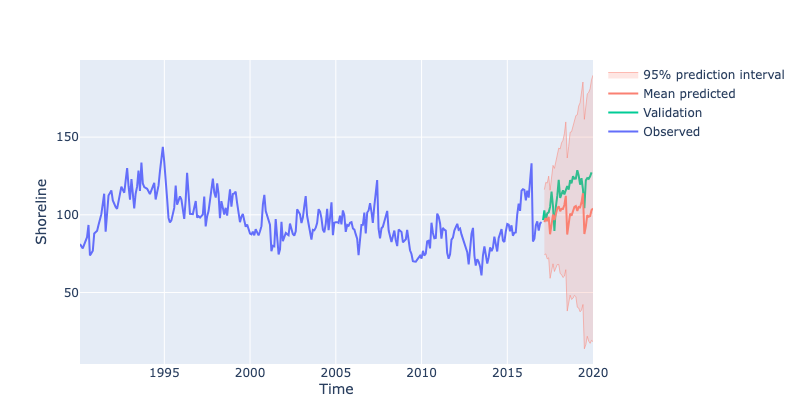
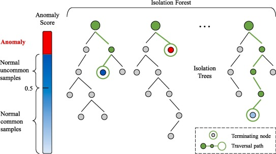

# Quiz 2 - 574

## Probabilistic Forecasting

- We have been dealing with **point forecasts** (modelling averages)
- Want to estimate the **uncertainty** of our forecasts
  - or the extreme (e.g. 90% or 95% quantiles)
    - example: find upper quantile of electricity demand so that we can plan for the maximum demand
  - or predict the variance of the forecast (how volatile a metric will be in the future)

### Analytical

- Assume distribution of forecasts are normal

$$
\hat{y}_{T+h|T} \pm c \hat{\sigma}_{h}
$$

- $\hat{\sigma}_{h}$ is the standard deviation of the forecast
- $c$: coverage factor (e.g. 1.96 for 95% confidence interval)

$$
\hat{\sigma}_{h} = \sqrt{\frac{1}{T-K}\sum_{t=1}^{T} e_{t}^{2}}
$$

- Focus is finding $\hat{\sigma}_{h}$
  - $K$: number of parameters
  - $T$: total length of time series
  - $e_{t} = y_{t} - \hat{y}_{t|t-1}$
- Methods that have been derived mathematically:
  | Method | Forecast sd |
  |--------|--------------|
  | Mean | $\hat{\sigma}_{h} = \hat{\sigma_1} \sqrt{1 + \frac{h}{T}}$ |
  |Naive | $\hat{\sigma}_{h} = \hat{\sigma_1} \sqrt{h}$ |
  | Seasonal Naive | $\hat{\sigma}\_{h} = \hat{\sigma_1} \sqrt{\frac{h-1}{m}+1} $ |
  | Drift | $\hat{\sigma}_{h} = \hat{\sigma_1} \sqrt{h(1+\frac{h}{T})}$ |
- _Recall: $h$ is the forecast horizon (steps ahead), $m$ is the seasonal period_

```python
from pandas import pd

c = 1.96 # 95% confidence interval

train['pred'] = train['y'].shift(1)
train['residuals'] = train['y'] - train['pred']
sigma = train['residuals'].std()

h = np.arange(1, len(forecast_index) + 1)
naive_forecast = train['y'].iloc[-1]

# create lower and upper bound
naive = pd.DataFrame({"y": naive_forecast,
                      "pi_lower": naive_forecast - c * sigma * np.sqrt(horizon),
                      "pi_upper": naive_forecast + c * sigma * np.sqrt(horizon),
                      "Label": "Naive"},
                     index=forecast_index)
plot_prediction_intervals(train["y"], naive, "y", valid=valid["y"])
```

```python
# ETS
model = ETSModel(train["y"], error="add", trend="add", seasonal="add").fit(disp=0)

ets = model.get_prediction(start=forecast_index[0], end=forecast_index[-1]).summary_frame()
plot_prediction_intervals(train["y"], ets, "mean", valid=valid["y"], width=800)

# ARIMA
model = ARIMA(train["y"], order=(3, 1, 0), seasonal_order=(2, 1, 0, 12)).fit()

arima = model.get_prediction(start=forecast_index[0], end=forecast_index[-1]).summary_frame()
plot_prediction_intervals(train["y"], arima, "mean", valid=valid["y"], width=800)
```



### Simulation and Bootstrapping

- Assume future errors will be similar to past errors
- Draw from the distribution of past errors to simulate future errors

$$y_{T+h} = \hat{y}_{T+h|T} + \epsilon_{T+h}$$

```python
# Fit an ETS model
model = ETSModel(train["y"], error="add", trend="add").fit(disp=0)

# simulate predictions
ets = model.simulate(anchor="end", nsimulations=len(forecast_index),
                     repetitions=n_simulations,
                     random_errors="bootstrap")
# plot
ax = train["y"].plot.line()
ets.plot.line(ax=ax, legend=False, color="r", alpha=0.05,
              xlabel="Time", ylabel="y", figsize=(8,5));

# get quantiles
ets = pd.DataFrame({"median": ets.median(axis=1),
                    "pi_lower": ets.quantile(1-0.975, axis=1),
                    "pi_upper": ets.quantile(0.975, axis=1)},
                   index=forecast_index)
```


### Quantile Regression

- Wish to predict particular quantile instead of mean
  - e.g $q=0.9$ so we expect 90% of the future values to be below the forecast
- Pinball loss/ Quantile loss:
  $$
  \mathcal{L}=
       \left\{
  \begin{array}{ll}
        (1-q)(\hat{y}_{t,q}-y_t) \text{,} \;\; \text{ if } y_t < \hat{y}_{t,q} \\
        q(y_t-\hat{y}_{t,q}) \text{,} \;\;\;\;\;\;\;\;\;\; \text{ if } y_t \ge \hat{y}_{t,q} \\
  \end{array}
  \right.
  $$

| High Quantile                          | Low Quantile                            |
| -------------------------------------- | --------------------------------------- |
| Higher penalty for predicting **OVER** | Higher penalty for predicting **UNDER** |

#### Quantile Regression in PyTorch

see [here](https://pages.github.ubc.ca/MDS-2023-24/DSCI_574_spat-temp-mod_instructors/lectures/lecture5_uncertainty.html#quantile-regression)

Quantile loss is not currently a supported criterion in pytorch but it’s easy to define ourselves. We really have two options:

- Train a network for each quantile we want to predict; or
- Train a network to output multiple quantiles at once

### Evaluating Distributional Forecast Accuracy

- There are 4 main sources of uncertainty:

  1. Random error term
  2. Uncertainty in model parameter estimates
  3. Uncertainty in model selection
  4. Uncertainty about consistency of data generating process in the future

- Most methods only consider the first source of uncertainty
- Simulation tries to consider 2 and 3
- 4 is practically impossible to consider

## Anomaly Detection

- Outliers are observations that are significantly different from the rest of the data
  - Can be due to measurement error, data entry error, or just unique observations

### Rolling Median

- **Methodology**:
  1. Subtract the rolling median from data (with suitable window size)
  2. Calculate standard deviation of the residuals ($\hat{\sigma_r}$)
  3. Assume normally distributed residuals then identify outliers as outside the 95% confidence interval ($\pm 1.96 \hat{\sigma_r}$)

### STL Decomposition

- **Methodology**:
  1. Decompose time series to find residuals:
     - Non-seasonal data: use LOESS
     - Seasonal data: use STL (Seasonal-Trend decomposition using LOESS)
  2. Calculate $q_{0.1}$ and $q_{0.9}$ of the residuals
  3. Identify outliers as $\pm2 \times (q_{0.9} - q_{0.1})$

### Model-based

- **Methodology**:
  1. Fit a model to the data
  2. Identify outliers as significant deviations from model predictions (e.g. 95% confidence interval)

### ML approaches

- Train an ML model to predict outliers
- A few common packages: pyod, sklearn, luminaire, sklyline, etc.

#### Isolation Forest

- Built on basis of decision trees
- **High-level idea**:
  - randomly select a feature
  - randomly splits that feature into 2 values
  - repeat until all data points are isolated
- Less splits to isolate a data point = more likely to be an outlier
- Score = [0, 1] where 1 is an outlier, > 0.5 are normal observations.



- Example of sklearn's `IsolationForest`:

```python
from sklearn.ensemble import IsolationForest

outliers = IsolationForest(contamination=0.05).fit_predict(df) == -1
```

#### K-NN

- For each data point, calculate the distance to its k-th nearest neighbor
  - Large distance = outlier
- Supports 3 kNN detectors:
  1. Largest: distance to the k-th neighbor
  2. Mean: average distance to k neighbors
  3. Median: median distance to k neighbors
- pyod's `KNN()` outlier detection

```python
from pyod.models.knn import KNN

outliers = KNN(contamination=0.05).fit_predict(df).labels_ == 1
```

### Global vs Local Outliers

- **Global outliers**: A data point with its value is far outside of the entirety of the data set (e.g., billionaires)

- **Local/Contextual outliers**: A data point is considered a contextual outlier if its value significantly deviates from the rest the data points in the same context. (e.g., earning 50K income in a developing countries)

## Imputation

- **Imputation**: Filling in missing values/ outliers in a dataset
- Overarching techniques:
  1. Remove (`.dropna()`)
  2. Fill manually based on some expert-interpreted values (`.fillna()`)
  3. Fill with mean/median/mode (`.fillna()`)
  4. Fill based on rolling statistic, e.g. rolling mean/median
  5. Polynomial interpolation
  6. Fill based on temporal dependence
     - i.e. use same value from the same period last season, or average of all periods in the past season
  7. Fill with model fitted values
  8. Use `MICE` (Multiple Imputation by Chained Equations) from `statsmodels` or `IterativeImputer` from `sklearn`.
